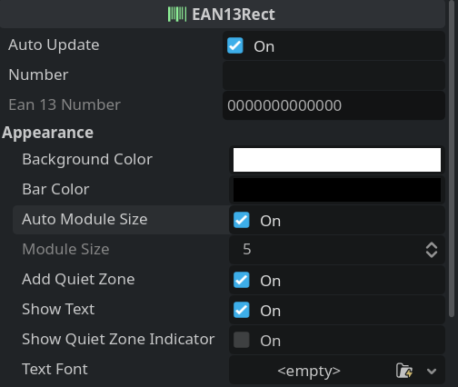

# EAN-13 Barcode

EAN-13 barcode generation and rendering addon for Godot. Provides a `EAN13Rect` node that can be used to display EAN-13 barcodes, as well as utility classes for encoding and rendering EAN-13 codes.

[**Download**](https://github.com/kenyoni-software/godot-addons/releases/tag/latest)

## Compatibility

| Godot | Version |
| ----- | ------- |
| 4.6   | all     |
| 4.5   | all     |
| 4.4   | all     |

## Screenshot

## Example

{{ kny:source "/examples/ean13/" }}

## Interface

### EAN13Rect

{{ kny:badge extends TextureRect --left-bg }}

{{ kny:source "/addons/kenyoni/ean13/ean13_rect.gd" "res://addons/kenyoni/ean13/ean13_rect.gd" }}

`TextureRect` like node. The texture updates automatically. Texture generation takes one frame, so changes to the number or other properties become visible one frame later.

#### Properties

| Name                                          | Type                   | Description                                                                                                                                                                                                       |
| --------------------------------------------- | ---------------------- | ----------------------------------------------------------------------------------------------------------------------------------------------------------------------------------------------------------------- |
| add_quiet_zone {: .kny-mono-font }            | {{ kny:godot bool }}   | Add a quiet zone around the code.                                                                                                                                                                                 |
| auto_module_size {: .kny-mono-font }          | {{ kny:godot bool }}   | Automatically set the module pixel size based on the size. Do not use expand mode `KEEP_SIZE` when using it. Turn this off when the EAN-13 Code is resized often, as it impacts the performance quite heavily. |
| auto_update {: .kny-mono-font }               | {{ kny:godot bool }}   | Automatically update the barcode when a property changes.                                                                                                                                                         |
| background_color {: .kny-mono-font }          | {{ kny:godot Color }}  | Background color.                                                                                                                                                                                                 |
| bar_color {: .kny-mono-font }                 | {{ kny:godot Color }}  | Bar color.                                                                                                                                                                                                        |
| module_size {: .kny-mono-font }               | {{ kny:godot int }}    | Use that many pixel for one module.                                                                                                                                                                               |
| number {: .kny-mono-font }                    | {{ kny:godot String }} | The number to generate the EAN-13 code for. Must be 12 or 13 digits long. If 12 digits are given, the checksum digit is calculated automatically. Non-digit characters are automatically removed.                 |
| show_quiet_zone_indicator {: .kny-mono-font } | {{ kny:godot bool }}   | Show an arrow indicator for the right quiet zone. Requires quiet zone to be enabled.                                                                                                                              |
| show_text {: .kny-mono-font }                 | {{ kny:godot bool }}   | Show the number as text below the bars. Requires quiet zone to be enabled.                                                                                                                                        |
| text_font {: .kny-mono-font }                 | {{ kny:godot Font }}   | Font for the text. If null, the default project font is used.                                                                                                                                                     |

#### Methods

{{ kny:godot String }} ean13() const {: .kny-mono-font }
:    The effective number used to generate the EAN-13 code, including the checksum digit. Only set if update was called.

void update() {: .kny-mono-font }
:     Updates the EAN-13 code and texture based on the current properties.

### EAN13

{{ kny:badge extends Object --left-bg }}

{{ kny:source "/addons/kenyoni/ean13/ean13.gd" "res://addons/kenyoni/ean13/ean13.gd" }}

EAN-13 encoding class.

#### Methods

{{ kny:godot int }} checksum(number: {{ kny:godot int }}) static {: .kny-mono-font }
:     Calculate the EAN-13 check digit for the given number.

{{ kny:godot String }} ean13(number: {{ kny:godot String }}) static {: .kny-mono-font }
:     Get the EAN-13 number including the check digit.
:     `number` must be a string of 12 digits; all non-digit characters are removed automatically.

{{ kny:godot String }} ean13_int(number: {{ kny:godot int }}) static {: .kny-mono-font }
:     Get the EAN-13 number including the check digit from an integer.

{{ kny:godot PackedByteArray }} encode(number: {{ kny:godot String }}) static {: .kny-mono-font }
:     Encode the given EAN-13 number and return the encoded data as a byte array. The returned array has a size of 95 bytes; each byte represents a module (`0` for light, `1` for dark).

{{ kny:godot bool }} validate(number: {{ kny:godot String }}) static {: .kny-mono-font }
:     Validate the given EAN-13 number.

{{ kny:godot bool }} validate_int(number: {{ kny:godot int }}) static {: .kny-mono-font }
:     Validate the given EAN-13 number.

### Ean13Renderer

{{ kny:badge extends Object --left-bg }}

{{ kny:source "/addons/kenyoni/ean13/renderer.gd" "res://addons/kenyoni/ean13/renderer.gd" }}

EAN-13 code renderer class.

#### Properties

| Name                                          | Type                  | Description                                                   |
| --------------------------------------------- | --------------------- | ------------------------------------------------------------- |
| add_quiet_zone {: .kny-mono-font }            | {{ kny:godot bool }}  | Add a quiet zone around the code.                             |
| background_color {: .kny-mono-font }          | {{ kny:godot Color }} | Background color.                                             |
| bar_color {: .kny-mono-font }                 | {{ kny:godot Color }} | Bar color.                                                    |
| show_quiet_zone_indicator {: .kny-mono-font } | {{ kny:godot bool }}  | Show an arrow indicator for the right quiet zone.             |
| show_text {: .kny-mono-font }                 | {{ kny:godot bool }}  | Show the number as text below the bars.                       |
| text_font {: .kny-mono-font }                 | {{ kny:godot Font }}  | Font for the text. If null, the default project font is used. |

### Methods

{{ kny:godot Image }} generate_image(ean13: {{ kny:godot String }}, encoded_data: {{ kny:godot PackedByteArray }}) const {: .kny-mono-font }
:     Generates an Image of the EAN-13 barcode based on the provided encoded data. Asynchronous method. For a synchronous version without text rendering call `generate_image_no_text`. Returns `null` if rendering failed.

{{ kny:godot Image }} generate_image_no_text(ean13: {{ kny:godot String }}, encoded_data: {{ kny:godot PackedByteArray }}) const {: .kny-mono-font }
:     Generates an Image of the EAN-13 barcode based on the provided encoded data, without rendering the text.

## Changelog

### 1.0.0

- Initial release.
