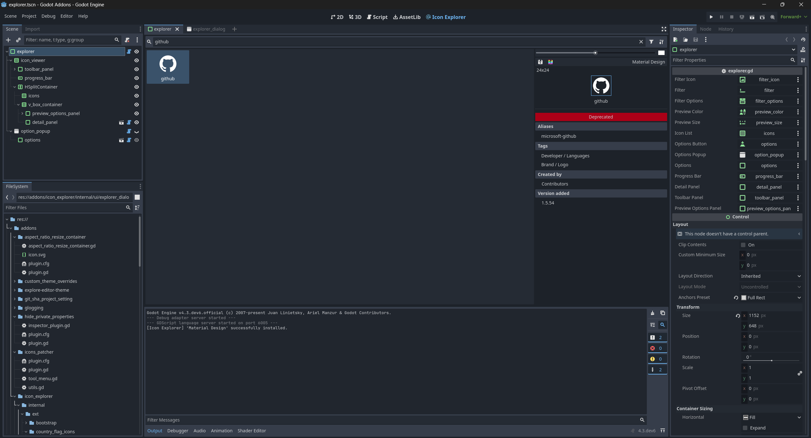
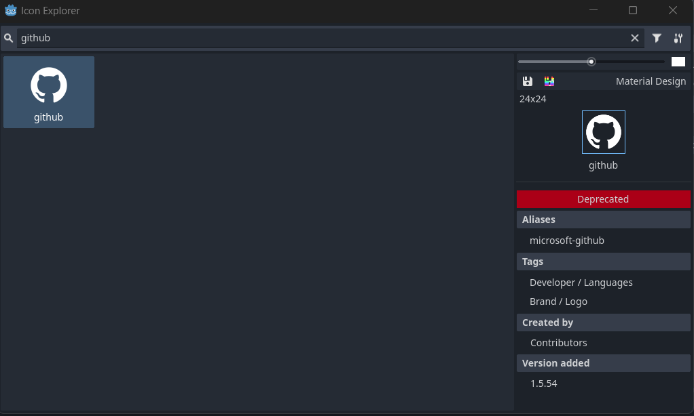

# Icon Explorer

Browse and save icons from popular icon collections.

You will find the Icon Explorer under `Project -> Tools -> Icon Explorer...` or directly in the main screen. You can install or update the icon collections via the options menu in the upper right corner. This process may take several minutes. If you prefer a cleaner workspace, you can disable the main screen button in the options. Note that the editor needs to be restarted for this change to take effect.

The tool supports filtering by collection and searching icons by name. You can save icons in white or with their original colors, change the preview color and size and choose whether to browse icons as a popup or from the main screen.

[**Download**](https://github.com/kenyoni-software/godot-addons/releases/tag/latest)

**Available collections**

- [Bootstrap Icons](https://github.com/twbs/icons) (since `1.0.0`)
- [country-flag-icons](https://gitlab.com/catamphetamine/country-flag-icons) (since `1.2.0`)
- [Font Awesome 6](https://github.com/FortAwesome/Font-Awesome) (since `1.0.0`)
- [Material Design](https://github.com/Templarian/MaterialDesign-SVG) (since `1.0.0`)
- [Simple Icons](https://github.com/simple-icons/simple-icons) (since `1.0.0`)
- [tabler Icons](https://github.com/tabler/tabler-icons) (since `1.0.0`)

!!! note

    Downloaded data is saved into `.godot/cache/icon_explorer` to avoid importing it.

## Compatibility

| Godot | Version       |
| ----- | ------------- |
| 4.6   | >= 1.5.0      |
| 4.5   | 1.4.0 - 1.5.0 |
| 4.4   | 1.4.0 - 1.4.4 |
| 4.3   | 1.2.0 - 1.3.0 |
| 4.2   | <= 1.1.0      |

## Screenshot

In Main screen:

As popup:

## Changelog

### 1.6.0

- Require Godot 4.6
- Upgrade scenes to Godot 4.6
- Improve ProjectSettings changed handling
- Use `EditorSettings` for storing settings, the `ProjectSettings` are removed

### 1.5.0

- Require Godot 4.5
- Use `@abstract` for abstract methods

### 1.4.4

- Fix Simple Icons 15.0 support

### 1.4.3

- Code improvements

### 1.4.2

- Code improvements

### 1.4.1

- Improve error checking
- Make `preview_size_exp` an internal setting
- Fix zip extraction to generate all directories

### 1.4.0

- Require Godot 4.4
- Add UIDs for Godot 4.4
- Use OS temporary directory for downloads
- Refactored ZIP extraction

### 1.3.0

- Support Tabler Icons 3 (you might need to reinstall this collection)
- Support Simple Icons 14
- Improve download speed and reduce installation time
- Improve Font Awesome icon loading

### 1.2.0

- Require Godot 4.3
- Make use of @export for custom Nodes
- Improve loading visualization
- Add Icons to Main Screen (this is optional and can be turned off)
- Add check for updates button
- Remove editor toast notification (access was removed)
- Focus filter input on opening

### 1.1.0

- Use editor toast notification

### 1.0.0

- Add icon explorer
