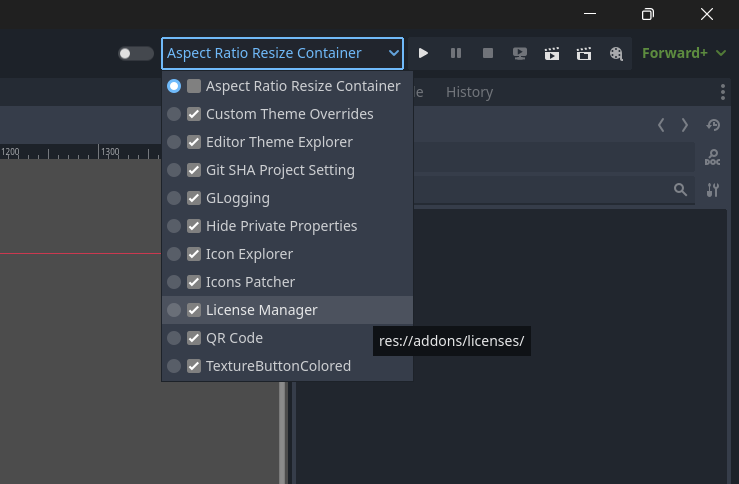

# Plugin Reloader

Enable or disable plugins from within the editor main screen.

[**Download**](https://github.com/kenyoni-software/godot-addons/releases/tag/latest)

## Compatibility

| Godot | Version       |
| ----- | ------------- |
| 4.6   | >= 1.0.0      |
| 4.5   | 1.0.0 - 1.2.2 |
| 4.4   | 1.0.0 - 1.2.2 |
| 4.3   | 1.0.0 - 1.2.2 |
| 4.2   | 1.0.0 - 1.2.2 |

## Screenshot

## Changelog

### 1.3.0

- Require Godot 4.6
- Upgrade scenes to Godot 4.6
- Improve ProjectSettings changed handling

### 1.2.2

- Code improvements

### 1.2.1

- Reload plugin list if changed in Godot's plugin dialog

### 1.2.0

- Find plugins recursively with infinite depth (was limited to 2 levels)

### 1.1.0

- Add UIDs for Godot 4.4

### 1.0.0

- Initial release
