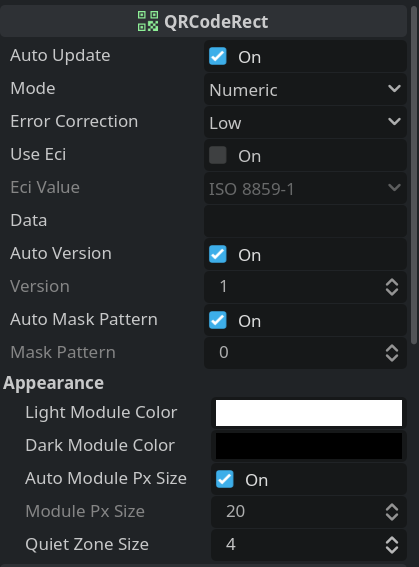

# QR Code

QR Code generation either with the included `QRCodeRect` node or use the encoding result of the `QRCode` class.

[**Download**](https://github.com/kenyoni-software/godot-addons/releases/tag/latest)

## Compatibility

| Godot | Version       |
| ----- | ------------- |
| 4.6   | >= 1.2.0      |
| 4.5   | >= 1.2.0      |
| 4.4   | >= 1.2.0      |
| 4.3   | 1.1.0 - 1.1.3 |
| 4.2   | 1.1.0 - 1.1.3 |
| 4.1   | <= 1.0.0      |

## Screenshot

## Example

{{ kny:source "/examples/qr_code/" }}

## Interface

### QRCodeRect

{{ kny:badge extends TextureRect --left-bg }}

{{ kny:source "/addons/kenyoni/qr_code/qr_code_rect.gd" "res://addons/kenyoni/qr_code/qr_code_rect.gd" }}

`TextureRect` like node. The texture is updated by itself.
When using byte encoding you can also pass strings for specific ECI values (ISO 8859-1, Shift JIS, UTF-8, UTF-16, US ASCII), the input string will be automatically converted to an byte array.

#### Properties

| Name                                   | Type                                                                 | Description                                                                                                                                                                                                                                                                                                                |
| -------------------------------------- | -------------------------------------------------------------------- | -------------------------------------------------------------------------------------------------------------------------------------------------------------------------------------------------------------------------------------------------------------------------------------------------------------------------- |
| auto_mask_pattern {: .kny-mono-font }  | {{ kny:godot bool }}                                                 | Use automatically the best mask pattern.                                                                                                                                                                                                                                                                                   |
| auto_module_size {: .kny-mono-font }   | {{ kny:godot bool }}                                                 | Automatically set the module pixel size based on the size. Do not use expand mode `KEEP_SIZE` when using it. If `auto_module_size` is set, this value might by only occasionally updated. In this case do not rely on it. Turn this off when the QR Code is resized often, as it impacts the performance quite heavily. |
| auto_update {: .kny-mono-font }        | {{ kny:godot bool }}                                                 | Automatically update the QR Code when a property changes.                                                                                                                                                                                                                                                                  |
| auto_version {: .kny-mono-font }       | {{ kny:godot bool }}                                                 | Use automatically the smallest QR Code version.                                                                                                                                                                                                                                                                            |
| dark_module_color {: .kny-mono-font }  | {{ kny:godot Color }}                                                | Color of the dark modules.                                                                                                                                                                                                                                                                                                 |
| data {: .kny-mono-font }               | {{ kny:godot Variant }}                                              | Type varies based on the encoding mode.                                                                                                                                                                                                                                                                                    |
| eci_value {: .kny-mono-font }          | {{ kny:godot String }}                                               | Extended Channel Interpretation (ECI) Value                                                                                                                                                                                                                                                                                |
| error_correction {: .kny-mono-font }   | [QRCode.ErrorCorrection](#qrcodeerrorcorrection) {: .kny-mono-font } | Error correction value.                                                                                                                                                                                                                                                                                                    |
| light_module_color {: .kny-mono-font } | {{ kny:godot Color }}                                                | Color of the light modules.                                                                                                                                                                                                                                                                                                |
| mask_pattern {: .kny-mono-font }       | {{ kny:godot int }}                                                  | QR Code mask pattern.                                                                                                                                                                                                                                                                                                      |
| mode {: .kny-mono-font }               | [QRCode.Mode](#qrcodemode) {: .kny-mono-font }                       | QR Code mode                                                                                                                                                                                                                                                                                                               |
| module_size {: .kny-mono-font }        | {{ kny:godot int }}                                                  | Use that many pixel for one module.                                                                                                                                                                                                                                                                                        |
| quiet_zone_size {: .kny-mono-font }    | {{ kny:godot int }}                                                  | Use that many modules for the quiet zone. A value of 4 is recommended.                                                                                                                                                                                                                                                     |
| use_eci {: .kny-mono-font }            | {{ kny:godot String }}                                               | Use Extended Channel Interpretation (ECI)                                                                                                                                                                                                                                                                                  |
| version {: .kny-mono-font }            | {{ kny:godot int }}                                                  | QR Code version (size).                                                                                                                                                                                                                                                                                                    |

#### Methods

void update() {: .kny-mono-font }
:     Update the QR Code.

### QRCode

{{ kny:badge extends RefCounted --left-bg }}

{{ kny:source "/addons/kenyoni/qr_code/qr_code.gd" "res://addons/kenyoni/qr_code/qr_code.gd" }}

QRCode class to generate QR Codes.

#### Properties

| Name                                  | Type                                                                 | Description                                     |
| ------------------------------------- | -------------------------------------------------------------------- | ----------------------------------------------- |
| auto_mask_pattern {: .kny-mono-font } | {{ kny:godot bool }}                                                 | Use automatically the best mask pattern.        |
| auto_version {: .kny-mono-font }      | {{ kny:godot bool }}                                                 | Use automatically the smallest QR Code version. |
| eci_value {: .kny-mono-font }         | {{ kny:godot String }}                                               | Extended Channel Interpretation (ECI) Value     |
| error_correction {: .kny-mono-font }  | [QRCode.ErrorCorrection](#qrcodeerrorcorrection) {: .kny-mono-font } | Error correction value.                         |
| mask_pattern {: .kny-mono-font }      | {{ kny:godot int }}                                                  | QR Code mask pattern.                           |
| mode {: .kny-mono-font }              | [QRCode.Mode](#qrcodemode) {: .kny-mono-font }                       | QR Code mode.                                   |
| use_eci {: .kny-mono-font }           | {{ kny:godot String }}                                               | Use Extended Channel Interpretation (ECI)       |
| version {: .kny-mono-font }           | {{ kny:godot int }}                                                  | QR Code version (size).                         |

#### Methods

{{ kny:godot int }} calc_min_version() const {: .kny-mono-font }
:     Return the minimal version required to encode the data.

{{ kny:godot PackedByteArray }} encode() {: .kny-mono-font }
:     Get the QR Code row by row in one array. To get the row size use `get_dimension`.

{{ kny:godot Image }} generate_image(module_size: {{ kny:godot int }}=1, light_module_color: {{ kny:godot Color }}=Color.WHITE, dark_module_color: {{ kny:godot Color }}=Color.BLACK) {: .kny-mono-font }
:     Generate an image. This method can be called repeatedly, as encoding will only happens once and the result is cached.

{{ kny:godot int }} get_dimension() const {: .kny-mono-font }
:     Returns the dimension for the current version.

void put_alphanumeric(text: {{ kny:godot String }}) {: .kny-mono-font }
:     Put a alphanumeric text. Invalid characters are removed. Will change the encoding mode to `Mode.ALPHANUMERIC`.

void put_byte(data: {{ kny:godot PackedByteArray }}) {: .kny-mono-font }
:     Put a bytes. Will change the encoding mode to `Mode.BYTE`.

void put_kanji(data: {{ kny:godot String }}) {: .kny-mono-font }
:     Put a kanji text. Invalid characters are removed. Will change the encoding mode to `Mode.KANJI`.

void put_numeric(number: {{ kny:godot String }}) {: .kny-mono-font }
:     Put a numeric text. Invalid characters are removed. Will change the encoding mode to `Mode.NUMERIC`.

### QRCode.Mode

{{ kny:source "/addons/kenyoni/qr_code/qr_code.gd" "res://addons/kenyoni/qr_code/qr_code.gd" }}

Encoding mode enum.

| Name                             | Value |
| -------------------------------- | ----- |
| NUMERIC {: .kny-mono-font }      | 1     |
| ALPHANUMERIC {: .kny-mono-font } | 2     |
| BYTE {: .kny-mono-font }         | 4     |
| KANJI {: .kny-mono-font }        | 8     |

### QRCode.ErrorCorrection

{{ kny:source "/addons/kenyoni/qr_code/qr_code.gd" "res://addons/kenyoni/qr_code/qr_code.gd" }}

Error correction enum.

| Name                         | Value |
| ---------------------------- | ----- |
| LOW {: .kny-mono-font }      | 1     |
| MEDIUM {: .kny-mono-font }   | 0     |
| QUARTILE {: .kny-mono-font } | 3     |
| HIGH {: .kny-mono-font }     | 2     |

### QRCode.ECI

{{ kny:source "/addons/kenyoni/qr_code/qr_code.gd" "res://addons/kenyoni/qr_code/qr_code.gd" }}

ECI values. See source code for available values.

### ShiftJIS

{{ kny:source "/addons/kenyoni/qr_code/shift_jis.gd" "res://addons/kenyoni/qr_code/shift_jis.gd" }}

Shift JIS encoding utility.

#### Methods

{{ kny:godot String }} get_string_from_jis_8(arr: {{ kny:godot PackedByteArray }}) static {: .kny-mono-font }
:     Get text from JIS 8 encoded bytes. Requires an u8 int array. Unknown characters are skipped.

{{ kny:godot String }} get_string_from_shift_jis_2004(arr: {{ kny:godot PackedByteArray }}) static {: .kny-mono-font }
:     Get text from Shift JIS 2004 encoded bytes. Requires an u16 int array. Unknown characters are skipped.

{{ kny:godot PackedByteArray }} to_jis_8_buffer(text: {{ kny:godot String }}) static {: .kny-mono-font }
:     Convert text to JIS 8 encoded bytes. Returns u8 int array. Unknown characters are skipped.

{{ kny:godot PackedByteArray }} to_shift_jis_2004_buffer(text: {{ kny:godot String }}) static {: .kny-mono-font }
:     Convert text to Shift JIS 2004 encoded bytes. Returns u16 int array. Unknown characters are skipped.

## Changelog

### 2.0.0

- Breaking Changes:
    - Moved to `res://addons/kenyoni/qr_code`
    - Renamed `QRCode.get_module_count` to `QRCode.get_dimension`
    - `QRCode` is no longer caching the encoding result
    - `QRCode.generate_image` is now static
    - Renamed `QRCodeRect.module_px_size` to `QRCodeRect.module_size`
    - Renamed `QRCodeRect.auto_module_px_size` to `QRCodeRect.auto_module_size`
    - `QRCodeRect` now caches the encoding result, changing appearance properties will not encode again
    - `QRCodeRect` no longer saves the texture to the scene file
- Added `auto_update` property to `QRCodeRect`
- Added `update` method to `QRCodeRect`
- Various bug fixes and code improvements

### 1.3.1

- Fix various bugs, which could lead to crashes and too large versions being selected
- Performance improvements

### 1.3.0

- Upgrade `.import`s to Godot 4.6

### 1.2.0

- Require Godot 4.4
- Add UIDs for Godot 4.4
- Update static typing

### 1.1.3

- Code improvements

### 1.1.2

- Use absolute paths in preloads

### 1.1.1

- Code optimizing

### 1.1.0

- Require Godot 4.2
- Add more values to plugin.cfg
- Add static typing in for loops

### 1.0.0

- Renamed `get_string_from_jis_2004` to `get_string_from_shift_jis_2004`

### 0.3.1

- Improve inspector properties
- Improve input handling of byte data based on ECI usage

### 0.3.0

- Make ECI value optional

### 0.2.0

- Added quiet zone size property
